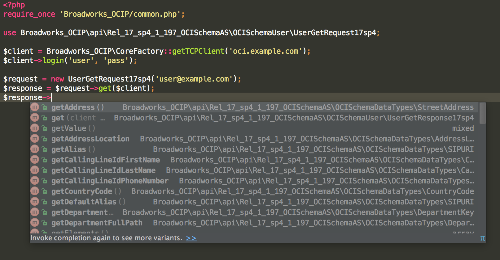
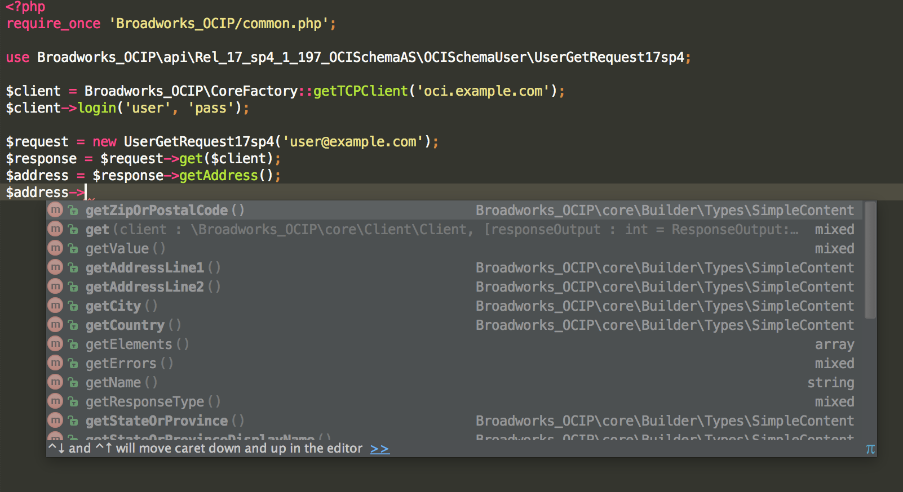

# Broadworks OCIP PHP docs - Luke Berezynskyj

The purpose of this framework is to provide an easy to use, robust framework to build Broadworks applications.

## Nutshell

* Requests and Response objects extend abstract base class 'ComplexType'.
* 'ComplexType' objects are built up of child elements as described in the schema.
* Child elements can be either ComplexType|SimpleType|SimpleContent|TableType|PrimitiveType.
* SimpleTypes may contain Restriction objects for input validation such as maxLength of minLength
* Communication with Broadworks uses HTTP SOAP or TCP Stream with an instance of a Transport object.
* Automatic ComplexType conversion (userGetResponse17sp4 --> userAddRequest17sp4)
* Client is the main controller for the whole framework to interact with the API

----------

IDE integration has been a first-thought so all methods are available for all objects

As you can see, getAddress() returns a ComplexType rather than SimpleType (nested xml)

